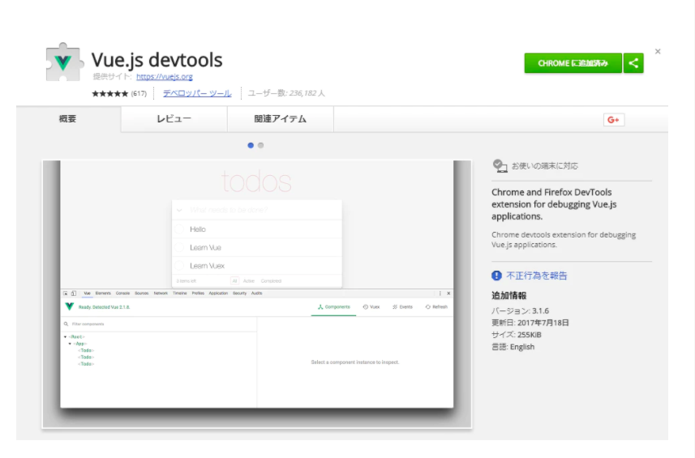
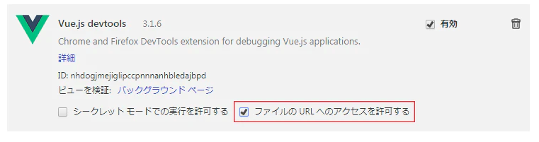
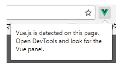
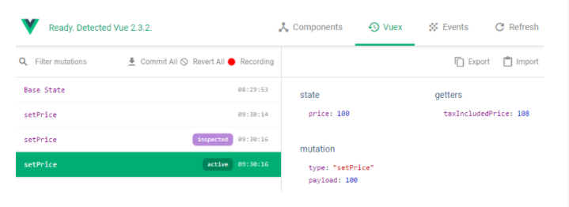
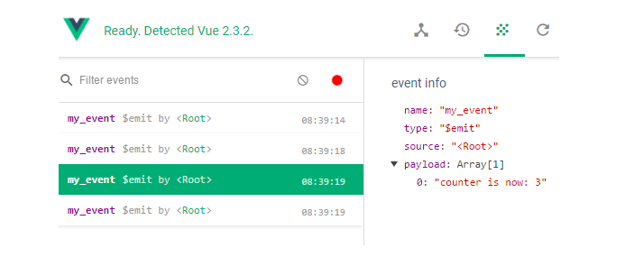

# Vue.js Devtoolsとは
Vue.jsの開発をサポートするChromeブラウザの拡張機能です。
これを導入すると、consoleを開かなくてもdataの中身などを確認することができるようになります。

## Vue.js Devtool のインストール
ではさっそくVue.js devtoolの導入方法について。まずは下記URLにアクセスして拡張機能を追加します。

[ダウンロードはこちら](https://chrome.google.com/webstore/detail/vuejs-devtools/nhdogjmejiglipccpnnnanhbledajbpd?hl=ja)  
拡張機能を追加したら、拡張機能の設定画面を開き、「ファイルのURLへのアクセスを許可する」にチェックを入れます。
これにチェック入れていないとローカル環境で開発を進めている時にVue.js Devtoolsが使えないので必ずチェックしましょう。 
 
  

インストール後にVue.jsを読み込んでいるファイルをブラウザ上で開くと、Vue.js Devtoolsのアイコンがアクティブになります。ここまできたら導入完了！  
デベロッパールール(検証)を開くと、「vue」というタブが追加されています。

## Vue.js Devtoolsの各タブの機能について

Vue.js Devtoolsの機能を紹介。

### Components  
Componentsタブでは、各コンポーネントの親子関係や保持しているdataの内容、Formなどに格納されているデータの中身を確認することが可能になります。  
コンポーネントの表示名には、親コンポーネントのcomponentsプロパティで設定している子コンポーネント名のアッパーキャメルケースが使われます。  

### Vuex  
このタブではVuexを使っている場合、storeの中の状態を確認することが可能になります。  
具体的には、ストア内の各stateの状態、getterで得られる値が表示されます。  
また、mutationをcommitした履歴が、時系列順に表示されます。
各commit履歴をクリックすると、その時にmutationに渡した値(payload)、commit後のstate, getterの値が確認できます。  
commitを選択すると表示される[Time Travel] (時計アイコン)を押すと、選択しているcommitを行った直後の状態にstateを書き戻すことができます。(実際に画面上の値も変わります)  
inspectedラベルがついているのが、現在詳細を表示中のcommitです。
activeラベルは、時系列の中で現在どこにいるのかを表しています。(つまり[Time Travel]で時間を移動すると、移動先がactiveになります)

### Events
このタブをみると画面のボタンを押すなどの、イベントがトリガーされた履歴を確認することが可能になります。

### Frames per second
Vuex やルーティングなどの動作のパフォーマンスを計測することができます。 レコーディングを Start し、ブラウザ操作を行った後に Stop するとその間のパフォーマンスを秒単位計測することができます。
アルファベットが書かれた丸いアイコンが、その動作を示しています。  
   

  
E: Events  
R: Routes  
M: Mutations  
Vuex の Mutations の動作が記録されるため、動作のタイミングを確認したり、重複している動作を見つけるのにも役立ちそうです。
